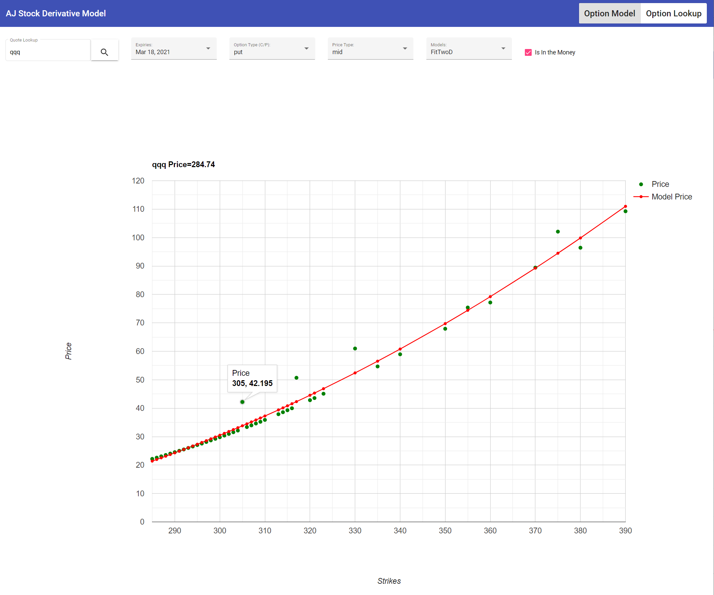
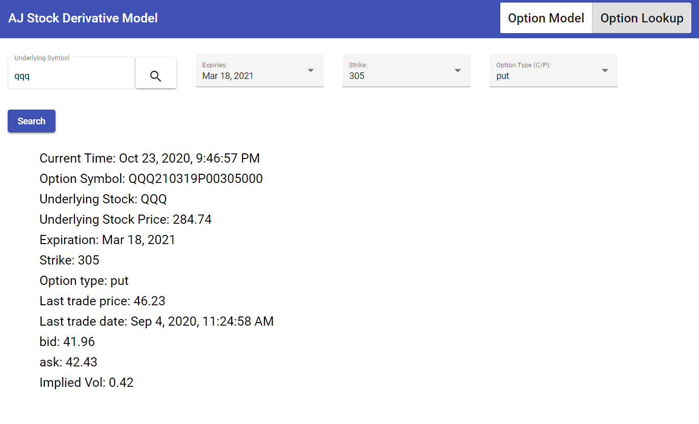

## Table of contents
* [General info](#general-info)
* [Application Screenshots](#application-screenshots)
* [Data](#data)
* [Technologies](#technologies-&-Open-source-libraries)
* [Setup](#Run-the-application-with-IDE)

## General Info
This application provides a user-friendly interface to find trade opportunities 
based on the difference between real price and model price. It also provides multiple models, 
so users can find solid trade opportunities by observing different model prices.
	
## Application Screenshots

## Data
* [Yahoo finance](https://query2.finance.yahoo.com/v7/finance/options/qqq) - Opitons

## Technologies & Open-source libraries

### Backend: 
* [JDK 14](https://docs.oracle.com/en/java/javase/14/) - Java™ Platform, Standard Edition Development Kit
* [Spring Boot 2.3.3](https://spring.io/projects/spring-boot) - Framework to create stand-alone Spring based application.
* [Maven](https://maven.apache.org/) - Build and manage java-based project.

### Frontend:
* [Angular 10](https://angular.io/) A platform and framework for building single-page client application using HTML and TypeScript.

### Libraries and Plugins
* [Apache common math](http://commons.apache.org/proper/commons-math/index.html) - Provides math utilities to solve common math problem 
* [Json Java](https://www.oracle.com/technical-resources/articles/java/json.html) - Parse JSON messages from yahoo finance
* [lombok](https://projectlombok.org/features/all)  - Reduce boilerplate code

### Run the application with IDE
* Clone the source code from Git repositoy.
* [Run Frontend](https://github.com/skatergu/stock-option/blob/master/options-frontend)
* Build and Run Backend: 
    1. Open Eclipse or Intellij 
    2. Right click the file com.aj.options.service.OptionsApplicaiton and Run as Java Application
* Open web browser and navigate to `http://localhost:4200/`

### Run the application with Executable JAR
 `git clone https://github.com/skatergu/stock-option.git` \
 `cd options-frontend` \
 `npm install` \
 `cd ..\options-backend` \
 `mvn clean install` \
 `java -jar target/java -jar target/options-backend-0.0.1-SNAPSHOT.jar` 
 
 Open a web browser and navigate http://localhost:8080

## Price Modeling
It provides four models: 
* SplineInterpolator
* AkimaSplineInterpolator
* Fit one dimension
* Fit two dimension
